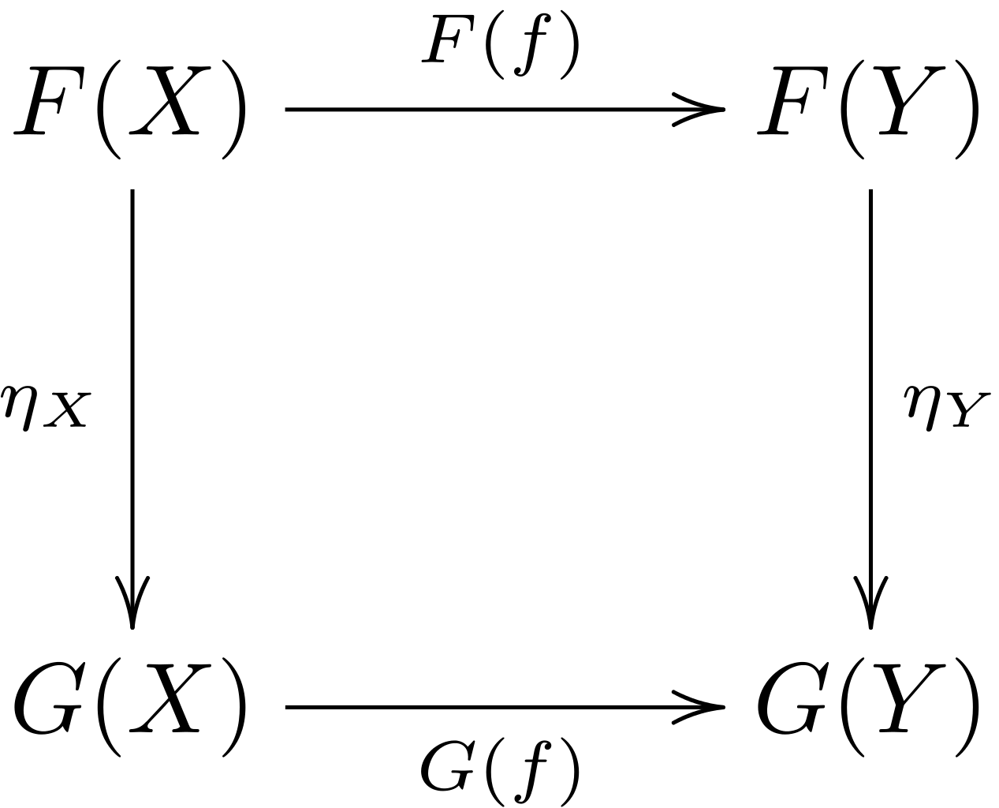
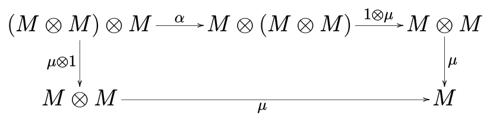
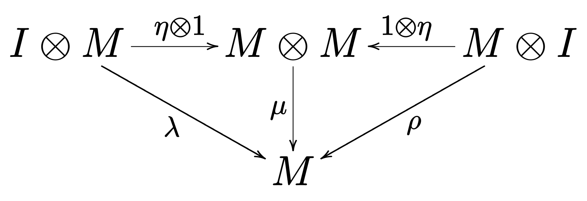

# 一个单子（Monad）说白了不过就是自函子范畴上的一个幺半群而已，这有什么好纠结的？

> 原文地址为 “[*A monad is a monoid in the category of endofunctors, what's the problem?*]( https://www.reddit.com/r/math/comments/ap25mr/a_monad_is_a_monoid_in_the_category_of/ )”，本文为中文翻译版本。

这句俚语出现在有趣的 “[*A Brief, Incomplete, and Mostly Wrong History of Programming Languages*](http://james-iry.blogspot.com/2009/05/brief-incomplete-and-mostly-wrong.html)” 一文中，是一个对函数式编程语言Haskell中晦涩难懂的数学概念开的玩笑。

我曾经研究过一点范畴论，并且也写过一些Haskell程序，这句话我见到过很多次，但是我从来没有真正花些功夫来证明它。最近，我花了几个小时的时间重新整理了下我生锈的范畴论知识，并搞懂了这句话的真正含义。我想把我的证明过程写下来，以确保我真正理解了它。所以...让我们开始吧！

## 什么是范畴？

[范畴](https://en.wikipedia.org/wiki/Category_(mathematics))是表示”对象”（或“点”）之间具有“态射”（或“箭头”）的集合，其满足两个非常简单的规则：

- 您可以将箭头`f: A -> B `与箭头`g: B -> C`复合成一个新的箭头`g . f: A -> C`，并且这种复合是满足结合律的（即`h .( g . f ) = ( h . g ) . f`）；
- 对于每个对象`A`，都有一个单位箭头`id_A: A -> A`，这样对于每个箭头`f: A -> B`我们都有`id_B . f = f . id_A = f`。

数学上的经典示例是集合范畴`Set`，其对象是集合，其箭头是这些集合之间的函数。在Haskell的世界中，我们有`Hask`范畴，其对象是Haskell里的类型，并且其箭头是这些类型之间的函数。例如，类型`Float`和`Int`是对象，而函数`round :: Float -> Int`是箭头。

## 什么是函子？

在范畴论中，函子是两个范畴之间的映射。因此，如果`C`和`D`是范畴，则函子`F: C -> D`会将`C`中的对象映射到`D`中的对象，并将`C`中的箭头映射到`D`中的箭头。当然，这种映射也需要满足以下一些规律：

- 如果`f`是从范畴`C`中从对象`A`到`B`的箭头，那么`F(f)`则是范畴`D`中从对象`F(A)`到对象`F(B)`的箭头；
- 单位态射保持，即`F(id_A) = id_F(A)`；
- 复合保持，即`F(g . f) = F(g) . F(f)`。

请注意，此处列出的概念比Haskell中的函子（Functor）的概念更为泛化（请参见下文）。

## 什么是自函子？

自函子是从一个范畴映射到其自身的函子。注意，这并不意味着自函子`F`不做任何事情。 就像从实数到实数的函数仍然可能会更改数字一样（译者注：`y = x + 1`），函子`F`仍可能会以某种方式更改对象和箭头。

## 什么是Haskell中的Functor？

在Haskell中所谓的Functor实际上是`Hask`范畴上的自函子。回想一下，`Hask`将类型作为其对象，并将这些类型之间的函数作为箭头。因此，在`Hask`上的自函子会将一个类型映射到其他类型，并且还将以某种优雅的方式将函数映射到函数。

这是[Haskell中Functor的定义]( http://hackage.haskell.org/package/base-4.12.0.0/docs/src/GHC.Base.html#Functor )：

```haskell
{- | The 'Functor' class is used for types that can be mapped over.
Instances of 'Functor' should satisfy the following laws:

> fmap id  ==  id
> fmap (f . g)  ==  fmap f . fmap g

The instances of 'Functor' for lists, 'Data.Maybe.Maybe' and 'System.IO.IO'
satisfy these laws.
-}

class  Functor f  where
    fmap        :: (a -> b) -> f a -> f b
```

上面的代码中，类型构造函数`f`承担函子对类型（对象）的作用，而`fmap`承担函子对函数（箭头）的作用。

Haskell中两个经典的函子便是列表（`[]`）和`Maybe`。

### 作为函子的列表

`List`是一个类型构造函数，给定某种类型`a`，它会为您提供新的类型`[a]`，即由类型`a`的值组成的列表。 这是类型（对象）的映射部分。对于函数的映射部分是则是`fmap`（也简称为`map`）。给定一些函数`f :: a -> b`，它将为您提供函数`fmap f :: [a] -> [b]`，即将`f`应用于类型为`a`的列表中的每个元素的函数。 您可以看到`fmap id`的确是单位态射：对列表的每个元素不执行任何操作与对列表不执行任何操作是相同的。 另一定律`fmap ( f. g) = fmap f . fmap g`也很容易看出来：先对列表的每个元素执行`g`，然后执行`f`，与首先对列表的每个元素执行`g`，然后对所得列表的每个元素执行`f`相同。

### 作为函子的Maybe

`Maybe`是一个类型构造函数，给定某种类型`a`会给你一个新的类型`Maybe a`。对于类型为`a`的任何`x`，此类型的值分别为`Just x`和`Nothing`。函数映射部分`fmap`将一些类型为`f :: a -> b`的函数映射为一个新的函数`fmap f :: Maybe a -> Maybe b`。其将`Just x`映射到`Just (f x)`，将`Nothing`映射到`Nothing`。你能够证明成为函子所需要满足的那些定律吗？

## 什么是自函子范畴？

好的，现在情况将变得有些棘手。 首先，我们需要讨论自然变换，它本质上是函子之间的映射。然后，我们将使用它来构建自函子范畴，最后，我们将研究Haskell中的例子。

### 什么是自然变换？

事实证明，如果范畴`C`和`D`以及函子`F, G: C -> D`之间存在关系，则有时可以在函子`F`和`G`之间找到所谓的“自然变换”。自然变换`t：F => G`是`D`中的箭头族，它满足两个要求：

- 箭头`t`从函子`F`映射的结果映射到函子`G`映射的结果。更确切地说，对于`C`中的每个对象`A`，在`D`中都有一个箭头`t_A`将函子`F`作用在`A`上的结果`F(A)`映射到函子`G`作用在`A`上的结果`G(A)`。这可以称作是自然变换`t`在`A`中的“分量”；

- 对于`C`中的每个箭头`f`，先应用`F(f)`然后再应用`t`与先应用`t`然后再应用`G(f)`相同。 这是“自然转变”的“自然”部分。更准确地说，对于`C`中的每个`f: X -> Y`，我们都有`t_Y . F(f) = G(f) . t_X`。 从图形上讲，这意味着沿任一方向围绕该图执行操作都是等价的（“图是交换的”）。

  

当然，有一种特殊情况，其中`F`和`G`是自函子。也没有什么可以阻止我们让`F = G`，自函子之间的自然变换仍然是有用的，它们能做很多事情。

###  自函子范畴

现在，对于某些范畴`C`，我们在`C`上有一些自函子，并且在这些自函子之间有了自然变换。 我们可以根据这些构造一个新的范畴！因此，让我们引入`Endo(C)`，它的对象是`C`上的自函子，并且其箭头是这些自函子之间的自然变换。您可以验证自然变换的复合确实是满足交换律的，并且存在从每个自函子到其自身的自然变换，即单位态射。但这在这里并不重要。

### Haskell中的自函子范畴

有点迷糊了吧？让我们考虑一下Haskell的世界是什么样的：`Endo(Hask)`是什么样的？好吧，它的对象是`Hask`上的自函子，在Haskell当中，自函子就是Functor。它的箭头是从一个Functor到另一个Functor的“变换”。因此，如果`f`和`g`是函子，那么我们正在寻找一组函数`t`，以便对于每种类型`a`，我们都有一个函数`t :: f a -> g a`。

让我们设`f = Maybe`和`g = []`。因此，我们正在寻找一组函数`t :: Maybe a -> [a]`。好吧，这是一个例子：

```haskell
maybeToList            :: Maybe a -> [a]
maybeToList  Nothing   = []
maybeToList  (Just x)  = [x]
```

好的，所以`maybeToList`是从自函子`Maybe`到自函子`[]`的变换。但是它是自然的吗？ 好吧，让我们采用一些任意函数`f: a -> b`。 如果`maybeToList`是自然的，则必须满足` maybeToList . fmap f = map f . maybeToList `（请注意，我已经为列表的`fmap`替代了`map`以避免混淆）。好吧，这很容易验证：

```haskell
(maybeToList . fmap f) Just x = maybeToList (Just (f x)) = [f x]
(map f . maybeToList ) Just x = map f [x]                = [f x]

(maybeToList . fmap f) Nothing = maybeToList Nothing = []
(map f . maybeToList ) Nothing = map f []            = []
```

是的，他们是一样的！因此，`maybeToList`是从自函子`Maybe`到自函子`[]`的自然变换。

另一个有趣的自然变换是`concat :: [[a]] -> [a]`。这是从`[[]]`（即两次应用自函子`[]`）到`[]`的自然变换。 同样，我们可以验证它是”自然“的条件` concat . map (map f) = map f . concat `（译者注：因为两次应用自函子，所以自函子`[[]]`对于箭头的映射是列表上的`fmap`即`map`对于自身的复合，即`map . map`）。

## 什么是幺半群（Monoid）？

好的，这将再次变得棘手。我们将按照以下步骤进行展开：

- 首先，我们将看一下集合论中的Monoid的经典概念。我们还将看一看Haskell中的此类Monoid的示例；
- 然后，我们将尝试从集合论到范畴论来泛化Monoid的概念。我们将意识到，我们的Monoid的定义缺少范畴论的成分。我们将定义“幺半范畴”；
- 有了幺半范畴，我们就能理解范畴中的Monoid到底是什么东西了。

### 集合论中的幺半群（Monoid）

在经典集合论中，一个[幺半群]( https://en.wikipedia.org/wiki/Monoid )是具有二元运算`•: M × M -> M`的集合，该运算满足以下性质：

- 结合律：对于`M`中所有的`a, b, c`，等式` (a • b) • c = a • (b • c) `成立，非正式地说：“你怎么放括号都无所谓。“ ；
- 幺元：在`M`中有元素`e`，使得`M`中所有的元素`a`满足等式` e • a = a • e = a `。

一个Monoid的例子是某个字母上所有有限字符串的集合，其中字符串串联是Monoid中的操作。 很容易检查结合律是否成立以及空字符串是否能够充当幺元。

这也为我们提供了Haskell中的示例：对于每个类型`a`，类型`[a]`是一个以++（串联）为二元运算且以空列表为幺元的Monoid。（请注意：从技术上讲，`[a]`类型还包括没有明确定义串联的无限列表。因此，从技术上讲，Haskell中的列表不是Monoid，也不是Monad。在下文中，我们将忽略这种技术性）。

### 范畴论中的幺半群（Monoid）

范畴论者对集合过敏，所以如果他们看到包含“集合”一词的数学对象的定义，他们将立即考虑如何不使用”集合“来重写此定义。或者，一个更加适当的做法是，他们将尝试泛化并推广该定义，使其也包含在集合范畴`Set`以外的范畴中。

很明显我们应当如何开始：集合`M`应该由范畴`C`中的任意对象`M`替换。二进制运算`•`应该由范畴中的某些箭头`μ`替换。 同样，由于我们无法“打开”范畴中的对象（译者注：范畴论是一种更加宏观和抽象的视角，打开对象会使得我们的视角变得狭隘），因此我们必须用指向`M`的箭头`η`来替换幺元。

箭头`μ`应该以`M`结尾，但是应该从哪里开始呢？我们需要某种方式来构造“乘积对象”，类似于集合的笛卡尔积。事实证明，有几种不同的方法可以实现此目的，但一个对重新定义Monoid有用的是”幺半范畴“中的”张量积“的概念。

### 幺半范畴

我们的目的是定义一些操作`⊗`，它使我们可以将范畴`C`中的两个对象`A, B`组合为同一范畴中的新对象`A ⊗ B`。 映射范畴中对象的自然方法是通过函子。但是在这种情况下，我们将不得不将两个对象映射到一个对象中。我们需要一个可以接受两个参数的函子。

解决此问题的典型方法是引入一个将两个参数编码为一个的乘积空间。因此，我们需要在某种乘积范畴`C × C`中有一个对象`(A, B)`。这时您可能会觉得我很疯狂：为了定义范畴中的Monoid，我们需要定义对象的乘积；为了定义对象的乘积，我们要定义幺半范畴；那么为了定义幺半范畴，我们需要定义整个范畴的乘积吗？

的确如此。幸运的是，这很简单。对于范畴`C`和`D`，乘积范畴`C × D`的对象是`C`中的对象`A`和`D`中的对象`B`的二元组`(A, B)`，其箭头由`f: A -> X`和`g: B -> Y`定义的二元组` f, g: (A, B) -> (X, Y) `组成。箭头的复合操作也很自然：` (f, g) . (k, l) = (f . k, g . l) `，其结合性也很容易验证**（译者注：此处的结合性指一个范畴中的态射的复合所需要满足的结合性）**。对于任何对象`(A，B)`，单位箭头为`(id_A, id_B)`。

好的，现在我们定义了乘积范畴，函子也变得可用了。我们希望函子`⊗: C × C -> C`（译者注：这个函子将乘积范畴中的对象映射到原范畴，也可以理解为一个二元的函子，将两个范畴中的元素映射到一个范畴）具有什么性质呢？**好吧，我们当然希望它在某种程度上是满足结合律的：我们希望`A ⊗ ( B ⊗ C )`与`( A ⊗ B ) ⊗ C`“相似”。这可以通过说存在自然变换来精确化。这个自然变换` α `以一个函子`A ⊗ (B ⊗ C)`（译者注：我们可以把这个函子看作一个三元运算，其将一个三元的乘积范畴映射到当前范畴，把三元的乘积范畴中的对象`(A, B, C)`映射成为原范畴的对象，由于两个函子所代表的三元运算不同，其映射的结果也不同，所以我们需要以(A, B, C)为分量的自然变换`α_(A, B, C)`）为参数，返回另一个函子`(A ⊗ B) ⊗ C`。类似地，我们希望`⊗`有幺元，我们称它为`I`：我们想要`I ⊗ A`和`A ⊗ I`与`A`”相似“。这可以再次精确化为一个自然变换，其成分为同构`λ_A: I ⊗ A -> A`（译者注：`λ_A: I ⊗ A -> id(A)`）和`ρ_A: A ⊗ I -> A`（译者注：`ρ_A: A ⊗ I -> id(A)`，也可以称这些自然变换为自然同构）**。这些自然变换之间很好地发挥了作用（“相干条件”），但我们将在此处跳过。

如果将本节与集合论中关于Monoid的那一部分进行比较，您可能会发现一些相似之处。**集合论中有元素，而在范畴论中有对象；集合论中的二元运算是`•`，而范畴论中我们有函子`⊗`；集合论中有幺元，而范畴论中我们有幺元`I`；集合论中有等式（译者注：`a • b = c • d`），而范畴论中我们有自然变换（译者注：`A ⊗ B -> C ⊗ D  `，其中箭头表示”同构“或”相等“）。**这种对应关系就是为什么名词“Monoid”被重新使用的原因，以及为什么将此范畴称为[幺半范畴]( https://en.wikipedia.org/wiki/Monoidal_category )的原因。

如果想更加强调一个范畴`C`中幺半结构，我们将称其为幺半范畴，同时使用记号` (C, ⊗, I)`加以表示。

### 幺半范畴中的Monoid

上面我们定义了一个类似于Monoid的概念。但是，这并不是我们想要的。一个幺半范畴是一个具有附加属性的范畴，而我们要寻找的是范畴中具有某些特定属性的对象，即”[幺半范畴中的Monoid对象]( https://en.wikipedia.org/wiki/Monoid_(category_theory) )“。

我们从一个Monoid的定义开始，然后将集合论的概念换成范畴论的概念。这是我们得到的：

一个幺半范畴` (C, ⊗, I)`中的Monoid对象是一个有两个特殊态射的对象，这两个态射分别为` μ: M ⊗ M -> M `和` η: I -> M `，这两者满足以下两个条件：

- 第一个条件——五角图交换：如果有一个对象`M`，那么`M ⊗ ( M ⊗ M ) ≅ ( M ⊗ M ) ⊗ M`，即先乘以左侧还是先乘以右侧都没有关系。那么态射`μ`的选择需要使得下面的五角图交换。

  

- 第二个条件——单位图交换：如果我们有一个对象` I ⊗ M ≅ M `，那么使用`λ`忘掉左边的部分与首先使用`η`映射到`M ⊗ M`然后再使用`η`映射到`M`相等。对于对称的情况仍然满足。

  

## 什么是自函子范畴上的幺半群？

好的，现在我们明白了什么是幺半范畴中的Monoid对象，我们可以开始考虑”什么是自函子范畴上的幺半群了“。

如上所述，我们首先需要在自函子范畴中找到一个Monoid结构。事实证明这很容易：**自函子的复合满足张量积的所有属性！幺元是单位函子`id`。 **我们仍然需要一点工作来证明自然变换的正确性，但是这里我们将跳过。

因此，在自函子范畴中的一个幺半群是某个自函子`M`，和两个自然变换`μ: M . M -> M`和`η: id -> M`，它们满足上面提到的成为Monoid对象的性质。

我们如何理解这个定义？好吧，这是一种可以很好地延伸到Haskell的方法：我们可以认为我们的自函子在它们所应用的对象上引入了一些其他结构。自函子对态射的作用是将态射“提升”到结构中。自函子`M`只是一些选定的结构。变换`μ`可以看作将重复的结构`M . M`展平为`M`。而变换`η`可以视为将非结构化数据引入到结构`M`中。

如何证明上面提到的成为Monoid对象的性质？

### 五角图交换

如果有一个三元结构` M . M . M `（译者注：由于函子的复合构成二元运算，所以我们使用`.`而不是`⊗`符号），将其展平为`M`的路径` (M . M) . M -> M . M -> M `和` M . (M . M) -> M . M -> M `并不重要，或者直观来说：只有一种方式来将多层结构展平；

### 单位是一个带乘法的幺元

- 如果有一个结构化的数据`M`（译者注：`I ⊗ M = id . M = M`），然后再使用`η `将其注入到`M`中（译者注：`η ⊗ 1 = η . id = η`），你会得到`M . M`，然后你可以使用`μ`来将其展平为`M`，这和什么都没做一样。即` μ_X . η_M(X) = id_M(X) `；
- 对称条件：如果有一个结构化的数据`M`，然后使用` M(η) `赋予`M`中内容以结构，你会再次得到`M . M`，然后你可以使用`μ`来将其展平为`M`，这和什么都没做一样。即` μ_X . M(η_X) = id_M(X) `。

 直观地说：注入结构并将其展平是彼此抵消的。

###  Endo(Hask)中的幺半群

 让我们重新回到Haskell。`[]`和`Maybe`都是自函子，偶们选择`M = []`，我们应该如何选择`μ`呢？它应该是一个自然变换` μ:: [[a]] -> [a] `，也就是`concat`。那` η `呢？它应该是一个自然变换` η:: id(a) -> [a] `，简写来说是` η:: a -> [a] `，这很简单：

```haskell
inject   :: a -> [a]
inject x = [x]
```

在Haskell中，这个函数同样被称为`pure`和`return`。

成为Monoid对象的性质呢？

对于第一个条件，任何三维列表，展平外层结构和展平内层结构相同。即` concat . concat = concat . (map concat) `，这个等式不难证明。

另一个条件呢？

- 先对列表添加结构再展平结构，其实什么都没做，即` concat . inject = id :: [a] -> [a] `，没什么问题；
- 对列表中的每一个元素添加结构再展平结构，也是什么都没做，即` concat . map inject = id :: [a] -> [a] `，也没什么问题。

所以`[]`就是自函子范畴`Endo(Hask)`上的一个幺半群（对象），或者也可以说，`[]`是`Hask`范畴上的一个Monad，万岁！